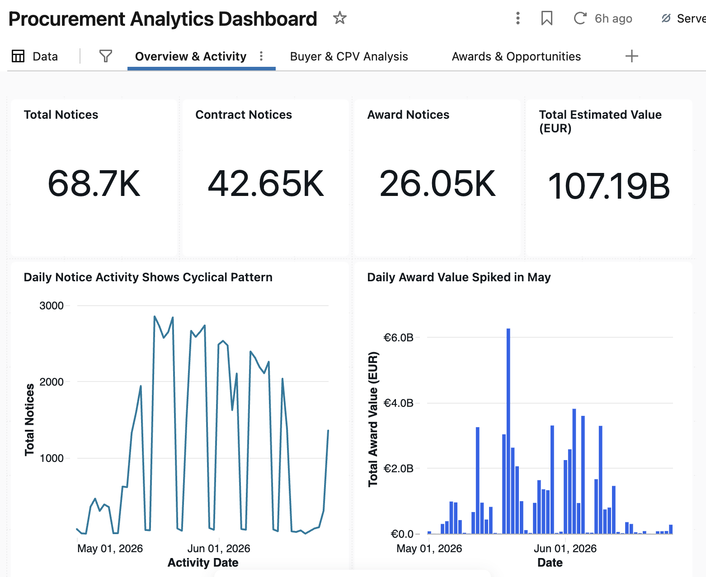
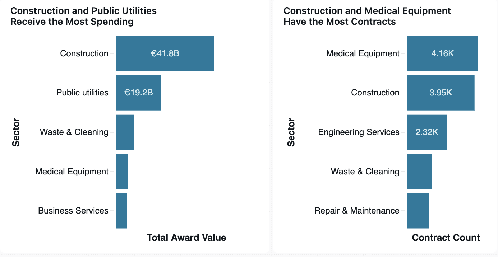

# Procurement Analytics Dashboard

## Overview

The Procurement Analytics Dashboard provides an executive-level view of EU procurement activity using Gold-layer tables generated through the Databricks Medallion Architecture.

The dashboard consists of three analytical pages.

---

# 1. Overview & Activity

Provides a high-level summary of procurement activity across the dataset.

### Executive KPIs

- Total Notices
- Contract Notices
- Award Notices
- Total Estimated Procurement Value

### Daily Activity

Shows procurement publication volume and total award value over time.

Key insight:
- Procurement activity follows cyclical publication patterns.
- Award spending peaked during May 2026.

---

# 2. Buyer & CPV Analysis

Provides geographical and sector-level procurement insights.

## Procurement Value by Country

Key insights

- France records over €28B in procurement spending.
- Italy exceeds €19B.
- Spain exceeds €10B.
- Poland exceeds €9B.

## Sector Analysis

Key insights

- Construction dominates procurement spending.
- Medical Equipment has the largest number of procurement notices.

## CPV Detail Table

Allows detailed exploration of procurement sectors.

---

# 3. Awards & Opportunities

Provides insight into completed procurement awards.

## Award KPIs

Displays

- Total awards
- Total award value
- Median award
- Largest award

## Award Distribution

Key insights

- Over 60% of awards are below €250K.
- Open procurement procedures account for the largest share of procurement spending.

## High Value Awards

Lists the highest-value procurement awards for further investigation.
